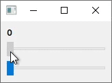
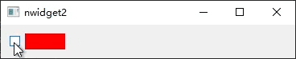
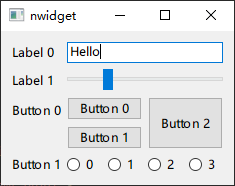
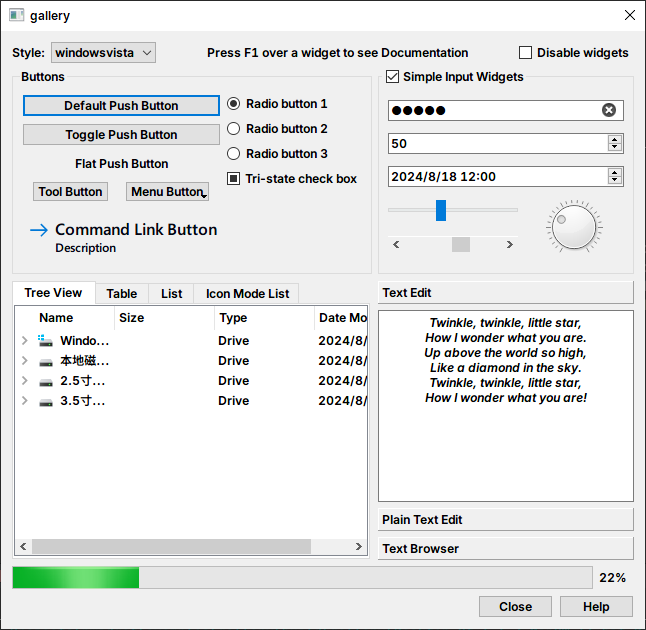
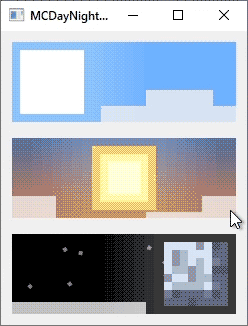

# nwidget2

nwidget is a `header-only` C++14 library that provides `property binding`, `declarative syntax` `animation` extension for QWidget.

It is designed based on the principle of low invasive, can be integrated without modifying existing code.

[How to use](./docs/How-to-use.md)

## Template Meta-Object System

```cpp
#include <nwidget/metaobjects.h>

using namespace nwidget;

using MetaObj  = MetaObject<QWidget>;
using MetaProp = decltype(MetaObj().fullScreen());

using Class      = MetaObj::Class;        // QWidget
using SuperClass = MetaObj::Super::Class; // QObject

using Type              = MetaProp::Type;       // bool
constexpr bool readable = MetaProp::isReadable; // true
constexpr bool writable = MetaProp::isWritable; // false
```

## Property Binding

```cpp
#include <nwidget/binding.h>

using namespace nwidget;

auto label   = MetaObject<>::from(new QLabel);
auto slider1 = MetaObject<>::from(new QSlider);
auto slider2 = MetaObject<>::from(new QSlider);

label.text() = nwidget::asprintf_("%d", slider1.value() + slider2.value());
```



## Animation

```cpp
#include <nwidget/behavior.h>

using namespace nwidget;

auto rect     = MetaObject<>::from(new QWidget);
auto checkBox = MetaObject<>::from(new QCheckBox);

rect.styleSheet() = "background: #FF0000";

Behavior::on(rect.minimumWidth(),
             new SpringAnimation<int>(
                 spring{2},
                 damping{0.2}));

cond(checkBox.checked(), 300, 50).bindTo(Behavior::animated(rect.minimumWidth()));
```



## Declarative UI Syntax

```cpp
#include <nwidget/builders.h>

using namespace nwidget;

QLayout* layout = FormLayout {
    {"Label 0" , LineEdit().text("Hello")},
    {"Label 1" , Slider(Qt::Horizontal).range(0, 100).value(25)},
    {"Button 0", GridLayout{
        {0, 0,       PushButton("Button 0")},
        {1, 0,       PushButton("Button 1")},
        {0, 1, 2, 1, PushButton("Button 2").sizePolicy(QSizePolicy::Preferred, QSizePolicy::Expanding),
        },
    }},
    {"Button 1", HBoxLayout {
        ForEach(4, [](int i){ return RadioButton().text(QString::number(i)); })
    }},
};
```



## Header Files

| Header File   | Description                                                      |
| ------------- | ---------------------------------------------------------------- |
| behavior.h    | Animation and Behavior                                           |
| binding.h     | Property Binding                                                 |
| builder.h     | Declarative UI Syntax Builder                                    |
| builders.h    | Builder specialization for Qt classes, include after Qt headers  |
| metaobject.h  | Template Meta-Object System                                      |
| metaobjects.h | Template specialization for Qt classes, include after Qt headers |

## Compatibility

I tested it in the following environment.

| OS      | Qt                   | Compiler              |
| ------- | -------------------- | --------------------- |
| Windows | 5.12.4, 6.4.3, 6.8.0 | MSVC 2017, 2019, 2022 |

## Examples

[Gallery](./examples/Gallery): [Widget Gallery](https://doc.qt.io/qt-6/qtwidgets-gallery-example.html) written with nwidget.



[MCDayNightSwitchButton](./examples/MCDayNightSwitchButton)



## Special Thanks

- [@QuadnucYard](https://github.com/QuadnucYard) for guidance on C++.
- [@Niwik](https://github.com/niwik-dev) for suggestions on the property binding.
